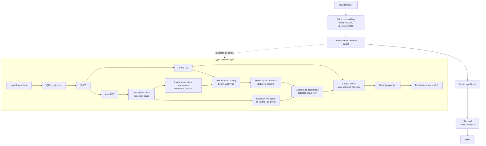

# Pythia-1B: полный INT4 KV-cache и hierarchical routing

Экспериментальная реализация Pythia-1B на чистом PyTorch находится в
[`Pythia_1B.ipynb`](./Pythia_1B.ipynb). Используются официальные веса Pythia-1B,
полный packed INT4 KV-cache и hierarchical routing.

Важно: routing не уменьшает число сохраняемых K/V-токенов. Для каждого токена
и каждого Transformer-слоя K/V вычисляются и записываются в полный cache. INT4
уменьшает константу памяти, а routing уменьшает число токенов, участвующих в
последующем attention.

## Архитектура



## Текущая конфигурация

| Параметр | Значение | Назначение |
|---|---:|---|
| Decoder layers | 16 | Transformer-слои Pythia-1B |
| Hidden size | 2048 | Размер скрытого представления |
| Attention heads | 8 | Размер head — 256 |
| `block_size` | 256 | Размер маршрутизируемого блока |
| `route_blocks` | 16 | Максимум выбранных исторических блоков |
| `beam_width` | 32 | Ширина иерархического поиска |
| `summary_parts` | 4 | Summary-векторы на блок |
| `global_blocks` | 1 | Обязательный глобальный блок |
| `local_blocks` | 2 | Обязательные последние исторические блоки |
| `local_window` | 256 | Последнее точное окно токенов |
| `route_refresh_interval` | 64 | Период обновления маршрута |
| KV representation | INT4 + per-token scales | Полное хранение K/V |
| Native trained context | 2048 | Контекст исходного checkpoint |

При `route_blocks=16` attention получает до `16 × 256 = 4096` токенов из
выбранных блоков плюс локальное окно, если оно не пересекается с ними. Остальные
токены не удаляются из cache: полная история остаётся в INT4 KV-cache.

## Что оптимизировано

### INT4 KV-cache

Для каждого слоя и каждого токена сохраняются quantized key/value и отдельный
scale. При использовании блока его значения деквантизуются и передаются в
обычный causal scaled dot-product attention.

INT4 уменьшает память, но не меняет её асимптотику:

```text
full KV-cache memory = O(N)
```

где `N` — длина контекста.

### Hierarchical routing

Summary-дерево обновляется инкрементально. Router выбирает блоки по summary,
после чего из полного INT4-cache извлекаются только выбранные блоки:

```text
full INT4 KV-cache
        |
        v
summary tree -> hierarchical route -> selected block IDs
                                      |
                                      v
                         dequantized exact K/V -> attention
```

При фиксированных `route_blocks`, `block_size` и `local_window` выбранный
attention имеет ограниченную зависимость от длины истории:

```text
selected attention = O(K · D),  K = O(1) относительно N
```

Иерархический refresh маршрута оценивается как:

```text
O(beam_width · log(N / block_size) · D)
```

Это не делает всю модель `O(1)`: prefill обрабатывает каждый входной токен,
проекции и MLP выполняются для каждого токена, а полный KV-cache остаётся
линейным по памяти.

## Память полного cache

Оценка для Pythia-1B prototype:

| Контекст | FP16 full KV-cache | INT4 full KV-cache |
|---:|---:|---:|
| 32,768 | 4.00 GiB | 1.02 GiB |
| 131,072 | 16.00 GiB | 4.06 GiB |
| 1,000,000 | 122.07 GiB | 30.99 GiB |

Оценка INT4 не включает веса модели, временные буферы attention, фрагментацию
allocator и системные расходы. Поэтому 1M токенов теоретически приближается к
пределу 32 GiB V100, но не является гарантированно запускаемым режимом на этой
GPU.

## Измеренные результаты

### Native-context quality

Полный INT4-cache на штатном контексте показал:

```text
context           = 2048
answer perplexity = 3.96
text exact match  = True
```

Это подтверждает, что INT4-cache сохраняет рабочее качество в пределах
контекста, на котором обучалась исходная модель.

### INT4 routed speed

На V100 для полной INT4 routed-модели получены следующие результаты:

| Prompt | Prefill tok/s | Decode tok/s | Peak allocated |
|---:|---:|---:|---:|
| 32,768 | 2,881 | 25.0 | 9.04 GiB |
| 131,072 | 2,486 | 24.7 | 12.46 GiB |

### Ограничение качества на сверхдлинном контексте

Pythia-1B обучена на 2048 токенах. Тесты на 14K и 32K используют необученную
RoPE-экстраполяцию и не являются доказательством качества long-context модели.

На 32K полный INT4 control также не смог надёжно извлечь synthetic needle:

```text
full INT4 context = 32768
perplexity        ≈ 18,757
```

Текущий результат следует формулировать так:

```text
INT4 и hierarchical routing дают инженерную основу для длинного контекста
и уменьшают attention workload, но качество на 32K/1M не доказано.
```

Для надёжной работы на сверхдлинных текстах необходимы RoPE scaling и
continued pretraining/fine-tuning на длинных последовательностях. Простая
замена attention или INT4-квантизация сами по себе не обучают Pythia понимать
позиции за пределами 2048 токенов.

## Статус проекта

Эксперимент остановлен на текущем этапе. Полученный прототип демонстрирует:

1. полное хранение K/V в packed INT4;
2. hierarchical content-dependent routing;
3. bounded selected-attention workload при decode;
4. линейное по контексту потребление памяти полного cache;
5. возможность проводить speed-only эксперименты на очень длинных входах.

Он не демонстрирует гарантированное качество Pythia-1B на 14K, 32K или 1M
токенах и не должен описываться как законченная long-context модель.
