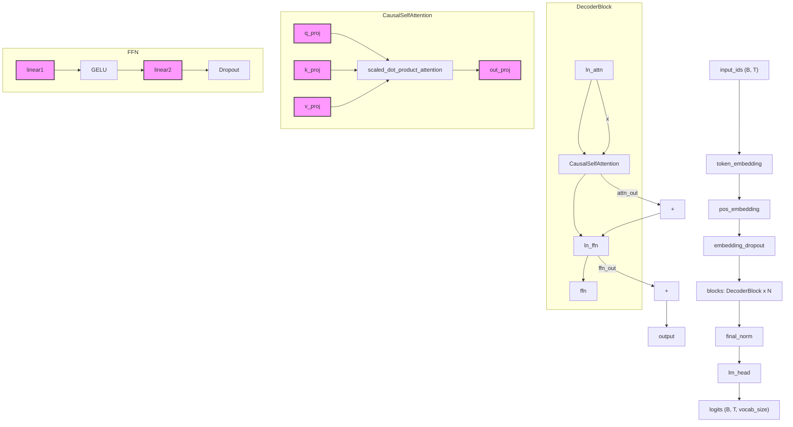

# LLM

```mermaid
graph TD
    A["input_ids (B, T)"] --> B[token_embedding]
    B --> C[pos_embedding]
    C --> D[embedding_dropout]

    D --> E["blocks: DecoderBlock x N"]
    E --> F[final_norm]
    F --> G[lm_head]
    G --> H["logits (B, T, vocab_size)"]

    subgraph DecoderBlock ["DecoderBlock"]
        I[ln_attn] --> J[CausalSelfAttention]
        J --> K[ln_ffn]
        K --> L[ffn]
    end

    subgraph CausalSelfAttention ["CausalSelfAttention"]
        M[q_proj] --> Q
        N[k_proj] --> Q
        O[v_proj] --> Q
        Q["scaled_dot_product_attention"] --> R[out_proj]
    end

    subgraph ffn ["FFN"]
        S[linear1] --> T[GELU]
        T --> U[linear2]
        U --> V[Dropout]
    end

    %% Связи внутри блока
    I -->|x| J
    J -->|attn_out| I_skip["+"]
    I_skip --> K
    K -->|ffn_out| K_skip["+"]
    K_skip --> output_block["output"]

    %% Опционально: указать, что линейные слои могут быть TernaryLinear
    classDef ternary fill:#f9f,stroke:#333,stroke-width:2px
    class M,N,O,R,S,U ternary
```
