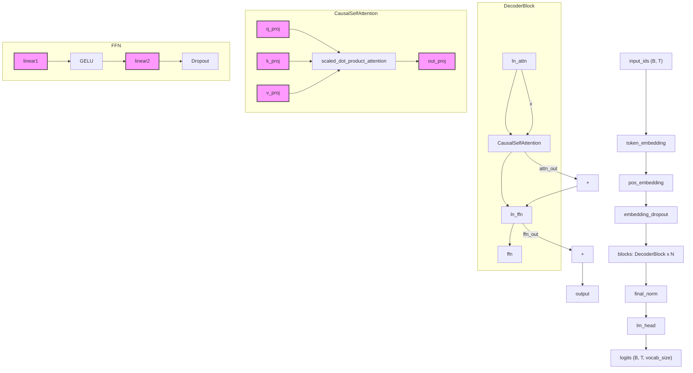
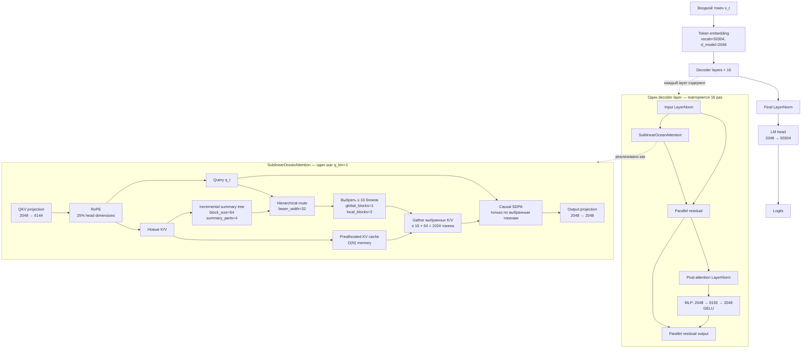

# LLM

## Базовая архитектура

## Оптимизированная Pythia-1B с иерархическим Ocean attention

Ниже показана фактическая streaming-архитектура, реализованная в `Pythia_1B.ipynb`. Модель сохраняет 16 decoder-слоёв Pythia-1B и исходные веса, но заменяет полное causal attention на query-dependent маршрутизацию по блокам KV-кэша.

### Конфигурация оптимизированной модели

| Параметр | Значение | Назначение |
|---|---:|---|
| Decoder layers | 16 | Число transformer-блоков Pythia-1B |
| Hidden size | 2048 | Размер скрытого представления |
| Attention heads | 8 | Число голов внимания |
| Head dimension | 256 | `2048 / 8` |
| `block_size` | 64 токена | Размер одного маршрутизируемого блока |
| `route_blocks` | 16 максимум | Сколько блоков может выбрать attention на шаге |
| `beam_width` | 32 | Ширина иерархического поиска маршрута |
| `summary_parts` | 4 | Число summary-представлений блока |
| `global_blocks` | 1 | Принудительно доступный глобальный блок |
| `local_blocks` | 2 | Принудительно доступные последние локальные блоки |
| Максимум выбранных токенов | 1024 | `16 × 64`, вместо всего префикса |
| Штатный контекст обучения | 2048 токенов | Контекст Pythia-1B, 14K — только стресс-тест |

Здесь «блоки, используемые для внимания» — это `route_blocks=16`: на каждом streaming-шаге attention работает максимум с 16 блоками, а не со всеми блоками префикса. Значение 5 было бы другим, более агрессивным режимом маршрутизации; в текущем экспериментальном конфиге используется 16.

### Асимптотика

При фиксированных `block_size=64`, `route_blocks=16`, `beam_width=32` и `summary_parts=4`:

- KV-кэш растёт как `O(N)` по длине контекста.
- Иерархические summary обновляются за `O(log N)` на новый токен.
- Маршрутизация занимает примерно `O(log N · beam_width · head_dim)` на шаг.
- Само выбранное attention занимает `O(route_blocks · block_size · head_dim)`, то есть `O(1)` по `N` при фиксированных параметрах.
- При фиксированных параметрах маршрутизации один streaming-шаг attention имеет порядок `O(log N)` для обновления дерева и поиска маршрута плюс константную работу по выбранным токенам; KV-кэш при этом занимает `O(N)` памяти.
- Для генерации последовательности длины `N` суммарная стоимость маршрутизации составляет примерно `O(N log N)`, тогда как у обычного incremental dense attention она составляет `O(N²)` из-за просмотра всего префикса на каждом новом токене.

Следовательно, это не безусловно «сублинейная модель» во всех смыслах: точнее говорить о sublinear routing и ограниченном attention-workload при линейной памяти KV-кэша. Качество маршрутизации подтверждено текущими экспериментами на Shakespeare, но не является доказательством эквивалентности dense attention на общих данных.
