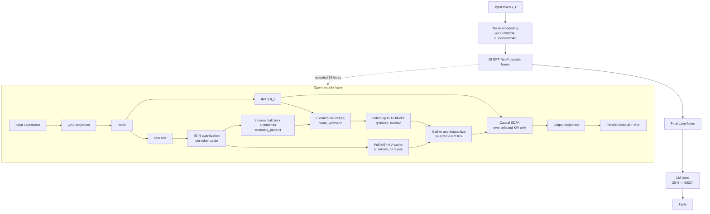

# Исследование каскадной маршрутизации блоков KV-cache для эффективной обработки длинного контекста в GPT-подобной модели

Экспериментальная реализация Pythia-1B на чистом PyTorch находится в
[`Pythia_1B_routing.ipynb`](./notebooks/Pythia_1B_routing.ipynb). Используются официальные веса Pythia-1B,
полный packed INT4 KV-cache и hierarchical routing.

Важно: routing не уменьшает число сохраняемых K/V-токенов. Для каждого токена
и каждого Transformer-слоя K/V вычисляются и записываются в полный cache. INT4
уменьшает константу памяти, а routing уменьшает число токенов, участвующих в
последующем attention.

## Архитектура



## Текущая конфигурация

| Параметр | Значение | Назначение |
|---|---:|---|
| Decoder layers | 16 | Transformer-слои Pythia-1B |
| Hidden size | 2048 | Размер скрытого представления |
| Attention heads | 8 | Размер head — 256 |
| `block_size` | 256 | Размер маршрутизируемого блока |
| `route_blocks` | 16 | Максимум выбранных исторических блоков |
| `beam_width` | 32 | Ширина иерархического поиска |
| `summary_parts` | 4 | Summary-векторы на блок |
| `global_blocks` | 1 | Обязательный глобальный блок |
| `local_blocks` | 2 | Обязательные последние исторические блоки |
| `local_window` | 256 | Последнее точное окно токенов |
| `route_refresh_interval` | 64 | Период обновления маршрута |
| KV representation | INT4 + per-token scales | Полное хранение K/V |
| Native trained context | 2048 | Контекст исходного checkpoint |

При `route_blocks=16` attention получает до `16 × 256 = 4096` токенов из
выбранных блоков плюс локальное окно, если оно не пересекается с ними. Остальные
токены не удаляются из cache: полная история остаётся в INT4 KV-cache.

## Что оптимизировано

### INT4 KV-cache

Для каждого слоя и каждого токена сохраняются quantized key/value и отдельный
scale. При использовании блока его значения деквантизуются и передаются в
обычный causal scaled dot-product attention.

INT4 уменьшает память, но не меняет её асимптотику:

```text
full KV-cache memory = O(N)
```

где `N` — длина контекста.

### Hierarchical routing

Summary-дерево обновляется инкрементально. Router выбирает блоки по summary,
после чего из полного INT4-cache извлекаются только выбранные блоки:

```text
full INT4 KV-cache
        |
        v
summary tree -> hierarchical route -> selected block IDs
                                      |
                                      v
                         dequantized exact K/V -> attention
```

При фиксированных `route_blocks`, `block_size` и `local_window` сам attention
по уже выбранным K/V имеет постоянный размер относительно длины истории:

```text
W = local_window
K = route_blocks × block_size
selected attention = O((W + K) · D) = O(1) относительно N
```

В текущем конфиге это максимум примерно `256 + 16 × 256 = 4352` candidate-
токена на decode-шаг. Полный KV-cache при этом не сокращается: routing только
решает, какие блоки читать.

Иерархический refresh маршрута оценивается как:

```text
O(beam_width · log(N / block_size) · D)
```

Следовательно, context-dependent часть одного decode-шагa имеет оценку:

```text
decode = O(1) selected attention + O(log N) hierarchical routing
       = O(log N) на refresh
```

Между refresh-операциями маршрут переиспользуется, и attention-часть шага
остаётся `O(1)` относительно `N`. Это не делает всю модель `O(1)`: prefill
обрабатывает каждый входной токен, проекции и MLP выполняются для каждого
токена, а полный KV-cache остаётся линейным по памяти.

## Память полного cache

Оценка для Pythia-1B prototype:

| Контекст | FP16 full KV-cache | INT4 full KV-cache |
|---:|---:|---:|
| 32,768 | 4.00 GiB | 1.02 GiB |
| 131,072 | 16.00 GiB | 4.06 GiB |
| 1,000,000 | 122.07 GiB | 30.99 GiB |

Оценка INT4 не включает веса модели, временные буферы attention, фрагментацию
allocator и системные расходы. Поэтому 1M токенов теоретически приближается к
пределу 32 GiB V100, но не является гарантированно запускаемым режимом на этой
GPU.

## Измеренные результаты

### PPL на контексте до 2048 токенов

Эти результаты получены на одном и том же Shakespeare-фрагменте: 2048 входных
токенов и 2047 next-token targets. Это quality benchmark, а не benchmark
генерации. Разные строки ниже относятся к разным экспериментальным runtime
paths, поэтому их следует сравнивать только внутри одинакового протокола.

| Вариант | Конфигурация | Mean NLL | PPL | Время | Tok/s |
|---|---|---:|---:|---:|---:|
| Dense baseline | обычный dense attention | 3.0698 | 21.5377 | — | — |
| Fast hybrid, full-scan | `chunk_size=256` | 3.0702 | 21.5462 | 0.782 s | 2,619 |
| Fast hybrid, hierarchical | `chunk_size=256` | 3.0697 | 21.5362 | 0.998 s | 2,052 |
| Sublinear streaming | `block=256, route=16, refresh=64` | 3.0691 | 21.5223 | 33.285 s | 61.5 |

На этом тесте hierarchical/streaming path сохраняет PPL практически на уровне
dense baseline. Это не доказывает качество на контекстах, для которых Pythia не
обучалась.

Отдельный synthetic needle-контроль для полного INT4-cache на штатном
контексте дал:

```text
context              = 2048
answer mean NLL      = 1.3756
answer perplexity    = 3.9576
text exact match     = True
```

Это другой тест: его PPL нельзя напрямую сравнивать с corpus-level PPL выше.

### Speed: от 14K до 1M токенов

В таблице ниже `prefill tok/s` — скорость обработки входного текста, а
`decode tok/s` — скорость генерации новых токенов. Это разные фазы.

#### Полный INT4 routed-cache

| Prompt | Prefill s | Prefill tok/s | Decode tok/s | Total s | Peak allocated |
|---:|---:|---:|---:|---:|---:|
| 32,768 | 11.373 | 2,881 | 25.01 | 12.012 | 9.04 GiB |
| 131,072 | 52.715 | 2,486 | 24.73 | 53.362 | 12.46 GiB |

Эта модель хранит полный INT4 K/V для каждого токена и использует routing
только для выбора блоков, передаваемых в attention.

#### Бounded local-plus-segment cache

Следующая таблица относится к другой speed-only реализации: она ограничивает
активное хранение локальным окном и логарифмическими сегментами. Это не full
INT4-cache и не quality benchmark.

| Prompt | Prefill s | Prefill tok/s | Decode tok/s | Total s | Peak allocated |
|---:|---:|---:|---:|---:|---:|
| 14,000 | 8.891 | 1,575 | 54.70 | 10.061 | 9.57 GiB |
| 32,768 | 22.579 | 1,451 | 50.28 | 23.852 | 11.96 GiB |
| 65,536 | 50.028 | 1,310 | 36.96 | 51.759 | 16.09 GiB |
| 131,072 | 100.474 | 1,305 | 47.95 | 101.809 | 24.36 GiB |

Для сравнения, dense Pythia на 14K показывала примерно 2,042 prefill tok/s и
37.54 decode tok/s, но этот 14K запуск является только speed stress test:
штатный обученный контекст Pythia равен 2048 токенам.

### Native-context quality

Полный INT4-cache на штатном контексте показал:

```text
context           = 2048
answer perplexity = 3.96
text exact match  = True
```

Это подтверждает, что INT4-cache сохраняет рабочее качество в пределах
контекста, на котором обучалась исходная модель.

### INT4 routed speed

На V100 для полной INT4 routed-модели получены следующие результаты:

| Prompt | Prefill tok/s | Decode tok/s | Peak allocated |
|---:|---:|---:|---:|
| 32,768 | 2,881 | 25.0 | 9.04 GiB |
| 131,072 | 2,486 | 24.7 | 12.46 GiB |

### Ограничение качества на сверхдлинном контексте

Pythia-1B обучена на 2048 токенах. Тесты на 14K и 32K используют необученную
RoPE-экстраполяцию и не являются доказательством качества long-context модели.

На 32K полный INT4 control также не смог надёжно извлечь synthetic needle:

```text
full INT4 context = 32768
perplexity        ≈ 18,757
```

Текущий результат следует формулировать так:

```text
INT4 и hierarchical routing дают инженерную основу для длинного контекста
и уменьшают attention workload, но качество на 32K/1M не доказано.
```

Для надёжной работы на сверхдлинных текстах необходимы RoPE scaling и
continued pretraining/fine-tuning на длинных последовательностях. Простая
замена attention или INT4-квантизация сами по себе не обучают Pythia понимать
позиции за пределами 2048 токенов.

## Статус проекта

Эксперимент остановлен на текущем этапе. Полученный прототип демонстрирует:

1. полное хранение K/V в packed INT4;
2. hierarchical content-dependent routing;
3. bounded selected-attention workload при decode;
4. линейное по контексту потребление памяти полного cache;
5. возможность проводить speed-only эксперименты на очень длинных входах.

Он не демонстрирует гарантированное качество Pythia-1B на 14K, 32K или 1M
токенах и не должен описываться как законченная long-context модель.

## Сравнение асимптотики с SubQ

Терминологически `O(N)` — линейная, а не сублинейная асимптотика. Она является
субквадратичной относительно обычного dense attention `O(N²)`.

| Операция | Dense GPT | Текущая Pythia full INT4 + routing | SubQ по публичному описанию |
|---|---:|---:|---:|
| Полный KV-cache | `O(N)` | `O(N)` | Заявлено `O(N)` |
| INT4 KV-cache | `O(N)` с меньшей константой | `O(N)` с меньшей константой | Детали не раскрыты |
| Выбранный attention одного decode-токена | `O(N)` | `O((W + K) · D) = O(1)` относительно `N` | Заявлена линейная SSA-архитектура |
| Hierarchical routing одного decode-токена | — | `O(log N)` на refresh, между refresh — переиспользование route | Заявлена линейная end-to-end селекция |
| Prefill attention | `O(N²)` | примерно `O(N)` при фиксированном chunk; полный текущий path зависит от routing/index maintenance | Заявлено `O(N)` |
| Полная обработка контекста | примерно `O(N²)` | примерно `O(N log N)` сейчас | Заявлено `O(N)` |

Для текущей модели:

```text
W = local_window
K = route_blocks × block_size
```

При фиксированных параметрах `W` и `K` не зависят от длины контекста. Поэтому
выбранный attention одного decode-токена имеет стоимость:

```text
O((W + K) · D) = O(1) относительно N
```

Однако hierarchical router всё равно ищет блоки в summary-дереве:

```text
O(beam_width · log(N / block_size) · D)
```

Поэтому полный context-dependent decode-шаг имеет оценку `O(log N) + O(1)`,
то есть примерно `O(log N)` на обновлении маршрута, а не строго `O(1)`. В
текущем prefill attention-вычисления для фиксированного chunk масштабируются
примерно линейно по числу входных токенов; дополнительные summaries и routing
могут добавить логарифмический множитель. Это описание сложности именно
компонентов, а не утверждение, что вся модель работает за `O(1)`.

Публичный технический отчёт SubQ заявляет, что SSA выполняет selection,
retrieval и sparse attention с линейным масштабированием по длине контекста.
Внутренние детали SSA и точные константы не раскрыты:

- [SubQ: Introducing SubQ](https://subq.ai/introducing-subq)
- [SubQ-1.1-Small Technical Report](https://subq.ai/docs/subq-1-1-small-model-card.pdf)

Главное различие состоит не только в routing. Ваша реализация — прозрачный
PyTorch-прототип с полным INT4 KV-cache и ручным hierarchical selector. SubQ
сообщает о совместном long-context обучении и end-to-end линейном SSA pipeline.
Поэтому для вашей модели доказан bounded attention workload, но не полноценная
линейная long-context система с гарантированным качеством на 1M токенов.

## Систематическое сравнение с опубликованными архитектурами

Отдельные элементы текущей реализации уже встречаются в научной литературе:
local/sliding-window attention — в Longformer и BigBird, content-based routing —
в Routing Transformer, иерархическое внимание — в H-Transformer-1D и Native
Sparse Attention, а query-dependent выбор страниц или токенов KV — в Quest и
TokenSelect. Поэтому новизна текущего прототипа должна оцениваться как возможная
новизна конкретной комбинации, а не как изобретение самого принципа sparse
attention.

| Архитектура | Основной механизм | Prefill | Decode одного нового токена | Память | Связь с текущей моделью |
|---|---|---:|---:|---:|---|
| Dense Transformer | Все query сравниваются со всеми key | `O(N²D)` | `O(ND)` | `O(N)` KV | Базовая Pythia-модель |
| FlashAttention | Tiled/IO-aware реализация dense attention | `O(N²D)` | `O(ND)` | `O(N)` рабочая память | Ускоряет kernel, но не меняет асимптотику вычислений |
| Longformer | Local window + глобальные позиции | `O(NWD)` | `O(WD)` | `O(N)` | Аналог local attention без content routing |
| BigBird | Local + random + global связи | `O(N(W+R+G)D)` | `O((W+R+G)D)` | `O(N)` | Похожая комбинация локальных и дальних блоков |
| Reformer | LSH-бакетизация похожих токенов | примерно `O(N log N)` | зависит от LSH-реализации | `O(N)` | Субквадратичный поиск, но другой механизм маршрутизации |
| Routing Transformer | Content-based clustering | примерно `O(N^1.5D)` | sparse attention | `O(N)` | Семантический routing уже исследовался |
| Performer | Kernel approximation для softmax | `O(NrD)` | `O(rD)` | линейная | Линейная аппроксимация, а не выбор блоков |
| Linformer | Низкоранговая проекция K/V | `O(NkD)` | `O(kD)` | линейная | Сжимает представление, но не маршрутизирует блоки |
| H-Transformer-1D | Иерархическое приближение attention | `O(N)` заявлено авторами | зависит от варианта | `O(N)` | Близок по иерархической организации |
| Quest | Query-aware выбор KV-страниц | зависит от selector | sparse read по top-K страницам | полный `O(N)` KV | Один из наиболее близких методов |
| TokenSelect | Query-dependent выбор KV-токенов | зависит от selector | sparse read по выбранным токенам | обычно `O(N)` KV | Похожий принцип, но token-level вместо block-level |
| Native Sparse Attention | Сжатие + fine-grained динамический выбор | sparse/hierarchical | sparse attention | зависит от реализации | Близкая современная trainable-архитектура |
| SubQ SSA | Content-dependent sparse attention | `O(N)` заявлено | субквадратично по заявлению авторов | `O(N)` заявлено | Наиболее близкий публичный промышленный пример |
| Текущая модель | Local + semantic blocks + hierarchical routing + INT4 KV | примерно `O(N log N)` в полном текущем path | примерно `O(log N)` на refresh | `O(N)` full INT4 KV | Прозрачный retrofit-прототип Pythia |

Ссылки на основные работы:

- [Longformer](https://arxiv.org/abs/2004.05150) и [BigBird](https://arxiv.org/abs/2007.14062) — фиксированные sparse-паттерны;
- [Reformer](https://arxiv.org/abs/2001.04451) — LSH attention;
- [Routing Transformer](https://arxiv.org/abs/2003.05997) — content-based routing;
- [Performer](https://arxiv.org/abs/2009.14794) и [Linformer](https://arxiv.org/abs/2006.04768) — линейные аппроксимации;
- [H-Transformer-1D](https://arxiv.org/abs/2107.11906) — hierarchical attention;
- [Quest](https://arxiv.org/abs/2406.10774) и [TokenSelect](https://arxiv.org/abs/2411.02886) — динамический выбор KV;
- [Native Sparse Attention](https://arxiv.org/abs/2502.11089) — trainable hierarchical sparse attention;
- [FlashAttention](https://arxiv.org/abs/2205.14135) — эффективный dense kernel без изменения `O(N²)` compute;
- [SubQ-1.1-Small Technical Report](https://subq.ai/docs/subq-1-1-small-model-card.pdf) — публичные заявления об SSA.

### Точная интерпретация асимптотики текущей модели

Пусть `B` — размер блока, `K` — число выбранных блоков, `W` — local window,
`R` — интервал обновления маршрута, а `D` — размерность head.

Само attention-ядро после выбора блоков читает:

```text
W + K × B
```

При фиксированных `W`, `K` и `B` это:

```text
O((W + K × B) × D) = O(1) относительно N
```

Но это не полная стоимость шага.

При full-scan routing router просматривает все блоки:

```text
O((N / B) × D)
```

на одно обновление. При фиксированных `B` и `R` такой decode остаётся `O(N)`
по зависимости от длины контекста.

При настоящем hierarchical routing без полного просмотра всех summaries поиск
имеет оценку:

```text
O(log_B(N / B) × D)
```

на refresh. Тогда средняя стоимость decode с переиспользованием маршрута:

```text
O(log(N) / R + W + K × B)
```

или примерно `O(log N)` при фиксированном `R`. Только при отдельном измерении
можно утверждать, что текущая реализация действительно выполняет такой обход:
Python-overhead, полные tensor-операции и memory movement способны скрыть
теоретический выигрыш.

Полный cache остаётся линейным:

```text
full INT4 KV-cache = O(N)
summary tree        = O(N / B) = O(N) при фиксированном B
```

Следовательно, корректное описание текущего прототипа такое:

```text
selected attention:       O(1) относительно N
hierarchical route:       O(log N) на refresh
full INT4 memory:         O(N)
full end-to-end prefill:  примерно O(N log N) в текущей реализации
```

Это субквадратичная архитектура, но не `O(1)`-модель целиком и не модель с
сублинейной памятью.

### Оценка потенциальной новизны

| Компонент | Статус по литературе |
|---|---|
| Local/sliding-window attention | Известный подход |
| Random/global блоки | Известный подход BigBird и родственных моделей |
| Content-dependent выбор блоков | Известный класс Routing Transformer, Quest, TokenSelect и NSA |
| Иерархические summaries | Известный класс hierarchical attention и индексов |
| Sparse read поверх полного KV-cache | Близко к Quest и TokenSelect |
| INT4 KV-cache | Известное инженерное направление |
| Полная комбинация INT4 + local + hierarchical block routing + exact selected attention | Может быть инженерно новой комбинацией, но требует отдельного сравнения |

Таким образом, текущая работа убедительнее всего формулируется как прозрачный
proof-of-concept конкретной системы маршрутизации и хранения KV, а не как уже
доказанное новое фундаментальное attention-открытие.
